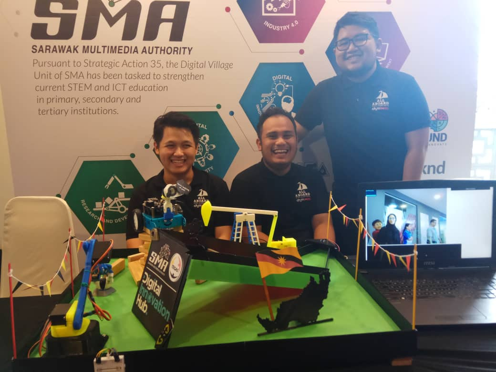

## Repo for SMA DIH Miri Launching

The documentation build using MKdocs and github pages. Accessible on this [site](https://aaylc.github.io/integrated-projects-docs/)

## Included files

* `.stl` - For 3D printing 
* `Fritzing` - Wiring sketch for robotic arm claw and donkey
* `.ino` - Source code for robotic arm claw and donkey
