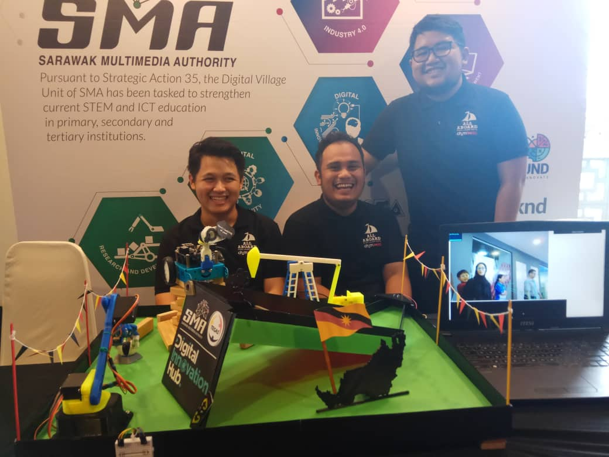
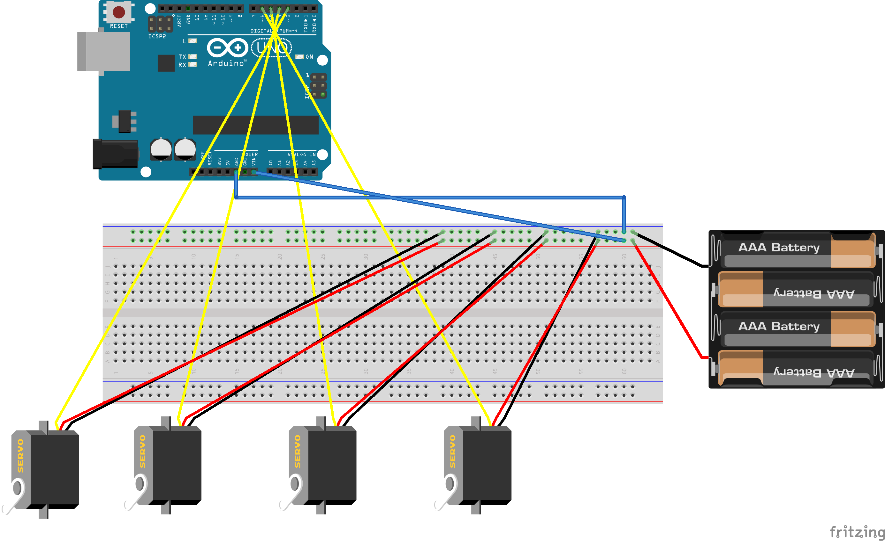

# Welcome to the documentation for SMA DIH Miri Launching integrated project
There are 3 important parts of the integrated project which are Robotic arm, Pump oil jack and pinball table. 



## Pump oil jack(donkey)
Pump oil jack design is created by Cisco Talos group that can be found on [Cisco Talos github](https://github.com/Cisco-Talos/oil-pumpjack), 
all parts are under stl directory. The oil pump will be activated if the ball pass through it, triggered by LDR sensor and laser. All files related 
to the pump oil jack can be found on [AAYLC repository](https://github.com/AAYLC/integrated-projects-docs/tree/master/oil-pumpjack)

### Pump oil jack components
1. Arduino Nano
2. DC Motor
3. DC Motor driver
4. Wires and jumper
5. AAA battery

### Pump oil jack design


Pump oil jack design consists of 6 different 3D printed parts. The original design have smoke generator and use
UNO instead of NANO. 

### Pump oil jack wiring


### Pump oil jack code
``` C
int inputPin = 6;               // choose the input pin (for PIR sensor)
int pirState = LOW;             // we start, assuming no motion detected
int val = 0;
int MOTOR_EN_1_2 = 4;
int MOTOR_IN1 = 3;
int MOTOR_IN2 = 2;


int slow = 64;
int normal = 128;
int fast = 255;

int Speed;


void Forward_Rev(void){
  analogWrite(MOTOR_EN_1_2, Speed);
  digitalWrite(MOTOR_IN1, HIGH);
  digitalWrite(MOTOR_IN2, LOW);
}

void Brake(void){
  digitalWrite(MOTOR_IN1, HIGH);
  digitalWrite(MOTOR_IN2, HIGH);
}


// variable for reading the pin status 
void setup() {
  pinMode(MOTOR_EN_1_2, OUTPUT);
  pinMode(MOTOR_IN1, OUTPUT);
  pinMode(MOTOR_IN2, OUTPUT);
  pinMode(inputPin, INPUT);     // declare sensor as input
 
  Serial.begin(115200);
}
 
void loop(){
  val = digitalRead(inputPin);  // read input value
  if (val == HIGH) {
    Forward_Rev();
    if (pirState == LOW) {
      // we have just turned on
      Serial.println("Motion detected!");
      // We only want to print on the output change, not state
      pirState = HIGH;
    }
  } else {
    Brake();
    if (pirState == HIGH){
      // we have just turned of
      Serial.println("Motion ended!");
      // We only want to print on the output change, not state
      pirState = LOW;
    }
  }

  Speed=slow; // Normal Speed
```


## Robotic arm claw 
Robotic arm clawbasically separated into 4 main parts which are base, controlled with powerful 360 degree servo, middle part which determine upper and lower position of the arm of the claw and the claw itself which is controlled by 9g servo model. All files related 
to the robotic arm claw can be found on [AAYLC repository](https://github.com/AAYLC/integrated-projects-docs/tree/master/robotic-arm-claw). For the claw design, the original files and author can be found on [Thingiverse](https://www.thingiverse.com/thing:3614519)


### Robotic arm claw components

1. Arduino Uno
2. Servo motor towerpro 9G
3. Servo motor towerpro(2)
4. Servo motor 360 towerpro MG995
5. Push button
6. LDR
7. Laser
8. Wires & jumper
9. AAA battery

### Robotic arm claw design


### Robotic arm claw wiring


For the wiring, since there are only one 5V pin on UNO, all of the servo motor will be powered by external AAA battery pack. This include the UNO to be powered by battery pack for portability power issue.

### Robotic arm claw code
``` C
//DIH Starter
#define btmSVpin 8
#define topSVpin 9
#define gripSVpin 10
#define spinSVpin 11
#define btnActivePin 13
#define btnStartPin 12

#include <Servo.h>

int armState = 0;
Servo btmServo;
Servo topServo;
Servo gripServo;
Servo spinServo;

void setup() {
  btmServo.attach(btmSVpin);
  topServo.attach(topSVpin);
  gripServo.attach(gripSVpin);
  pinMode(btnActivePin, INPUT_PULLUP);
  pinMode(btnStartPin, INPUT_PULLUP);
  delay(1000);
  startPos();
}

void loop() {
  int btnActiveState = digitalRead(btnActivePin);
  int btnStartState = digitalRead(btnStartPin);
  Serial.println(btnActiveState);
  if (btnActiveState == HIGH) {
    activateEvent();
  }
  if (btnStartState == HIGH) {
    startPos();
  }
}

void startPos() {
    btmServo.write(45);
    topServo.write(120);
    gripServo.write(15);
    spinServo.write(90);
    spinServo.detach();
}

void activateEvent() {
  spinServo.attach(spinSVpin);
  btmServo.write(46);
  topServo.write(120);
  delay(1000);
  btmServo.write(100);
  topServo.write(85);
  delay(1000);
  spinServo.write(45);
  delay(325);
  spinServo.write(90);
  delay(1000);
  btmServo.write(55);
  topServo.write(55);
  delay(500);
  topServo.write(75);
  delay(1000);
  gripServo.write(40);
  spinServo.detach();
}
```


## Pinball Table design
Pinball table design taken from Thingiverse with certain elements modified so that it fit with the flow of the whole integrated design. The original design can be found [here](https://www.thingiverse.com/thing:1040572).


## Tools and resources used during this project
* `Ultimaker Cura` - 3D design slicer for 3d print
* `Fusion 360` - 3D design software
* `Freecad` - Opensource 3d design software
* `MKdocs` - Simple and easy Markdown based documentation builder
* `Github` - Online repository and version control system
